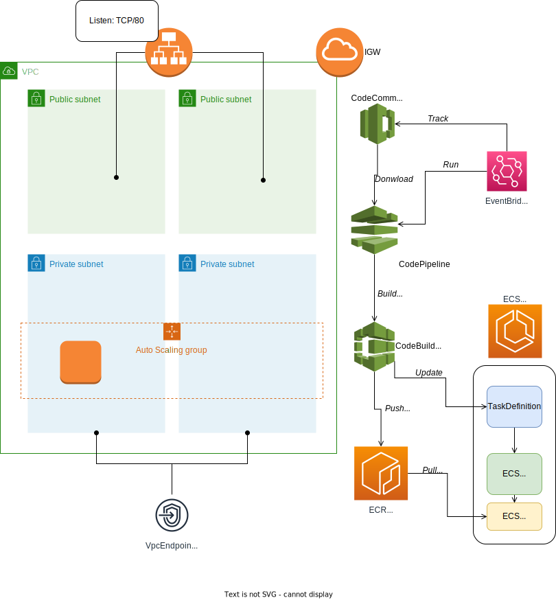

# CloudFormation templates
## cfn_stacks/VPC.yaml
Creating a VPC with several Public Subnets and IGW
## cfn_stacks/ECS_Ec2.yaml
ECS cluster with EC2 capacity provider, basic Task definition and Service with Public ALB as a frontend

## cfn_stacks/ECS_Fargate.yaml
ECS cluster with Fargate capacity provider, basic Task definition and Service with Public IP auto-assigned
## cfn_stacks/CICD.yaml
CodeBuild project and CodePipeline to track updates of the CodeCommit repo and update the Task container image

## ./https_server.py
A simple python script. Reads the './test.html' file and runs simpleHTTPserver

## ./test.html
A simple HTML file for the test server

## ./Dockerfile
Container build file for creating an image

## ./buildspec.yml
CodeBuild workflow scenario for building a docker image and pushing it to the ECR

---
Basic Design:
